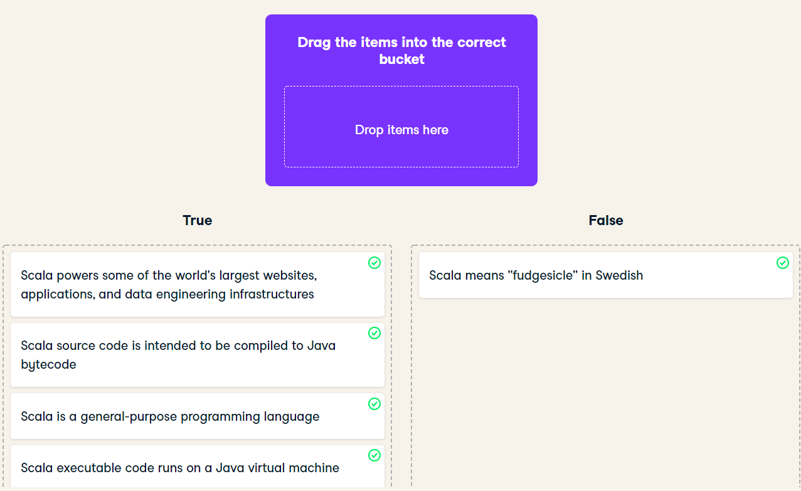

## **Exercise**

- What is scala ?
   - Welcome to Introduction to Scala! In this exercise, you'll categorize statements as either true or false so you will be able to answer the question "What is Scala?"

## **Instructuin**
- Categorize the following statements about Scala as true or false.

# ***Answer***
