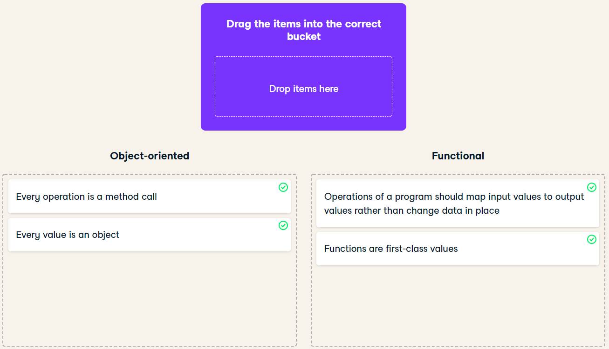

## **Exercise**

- What makes Scala scalable?

  - The scalability of a language depends on several factors. The creator of the language (Martin Odersky), however, believes there are two main factors that contribute the most to Scala being scalable: Scala being object-oriented and Scala being functional.

  - In this exercise, you'll demonstrate your knowledge of what each factor means by classifying statements about them.

  - `scala> val symbolAceSpades: String = "A♠"`

## **Instruction**
- Classify the following features of Scala as object-oriented or functional.

# ***Answer***
