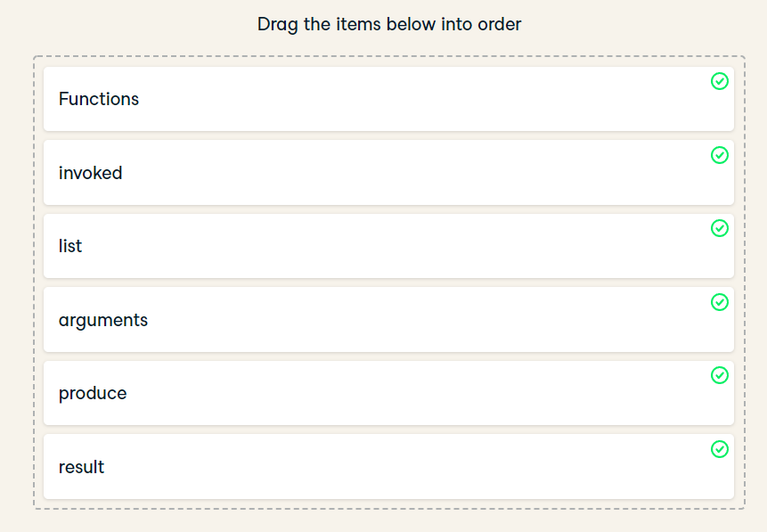

## **Exercise**

- What do functions do?
  - Before you can use functions, you need to understand what functions are conceptually.
  - In this exercise, you'll answer the second subquestion of the larger "What is a function?" question: **"What do functions do?"**

# ***Answer***

